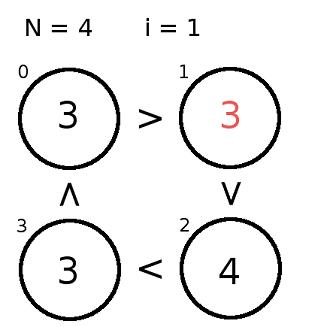
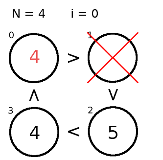
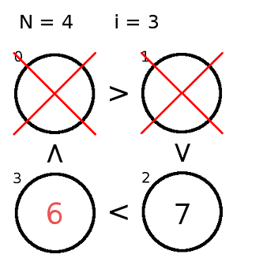
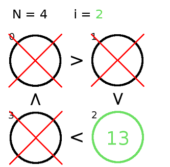

# Lab 03: Pointers->get_excited()

## 1. Introduction 
Today you will implement a class called MancalaSolver, which uses a circular singly-linked list to play a game called Mancala Solitaire, given some input. The goal of this lab is to give you a deeper understanding of the linked list data structure that you learned about in lecture. In order to understand the usage of linked lists, a refresher on pointers has been included. 
## Part 2.0. Starting Out With Pointers

To start off your wonderful journey into the world of pointers, you will start by looking at instantiations of two variables, an int and an int * (a pointer to an int, or an int pointer).  
```C++
// Declare an int variable, assign it the value 5
int number = 5;

// Declare a pointer to an int and set it to the address of number
int *numberPtr = &number;

```
The first line of this example declares an 'int' called 'number' and sets it to the value '5'. 

Before discussing what happens on the next line, it's important to know that every variable in a program has a memory address associated with it. As it turns out, you as a programmer can do things with these memory addresses in your programs, and that's what pointers are all about.

The second line declares an 'int *' called numberPtr, ("ptr" being short for "pointer"), and sets it to the memory address of the variable 'number' using the **address-of operator '&'**. This operator is used to get a variable's memory address. It should then be clear than **an int \* is just a variable that holds the memory address associated with an 'int'**. 

Now, getting the memory address of a variable wouldn't be very helpful if you couldn't use it to get back to the original variable.

```c++
//Change the value of the number using the pointer
*numberPtr = 10;

```

The above code snippet uses the '*' operator for something much different than multiplication. In this case, the * is called the Dereference operator. Dereferencing a pointer directly accesses the element it points to. This has the added benefit of allowing you to modify the value at that address without specifically needing a variable associated with it.

#### Part 2.1. Passing Arguments by Value

As the above example displayed, it is possible to change the value of a variable from a pointer that contains the memory address of said variable. If this still feels daunting to you, you can feel comforted by the fact that you've already done this! This is something that you took advantage of in the previous lab. 
```c++
template <typename T1>
void bubbleSort(vector<T1> &a) {
    for (int i = 0 ; i < a.size() - 1 ; i++) {
        // Last i elements are already in place
        for (int j = 0; j < a.size()-i-1; j++) {
            if (a.at(j) > a.at(j + 1)) {
                std::swap(a.at(j), a.at(j + 1));
            }
        }   
    }
}
```

In the above code snippet, we can see that one of the parameters contains the **address-of operator '&'**. This is what allowed us to obtain a sorted vector without ever having to return anything! Passing a pointer to the function allowed us to make changes directly to the original vector

:white_check_mark: Question 1: How would the functionality of the bubbleSort function change, if the address-of operator was removed?
#### Part 2.2. Arrays and Pointers! 
Now that the ground work for pointers have been established, we can take some of their usages a step further and alter an array with the use of a **dereferencing operator '\*'**

```c++
void doubleArray(int size, int *ptr){
    
    for (int i = 0; i < size ; i++){
        // This is equivalent to ptr[i]
        *(ptr + i) = *(ptr + i) * 2 ;

    }
}
```

In the above code snippet, we have created the parameters 'int size' and 'int *ptr'.  The first parameter is the size of the array and the second parameter is an array. An array stores its values in a sequence of memory locations and when an array is passed in as a parameter it is the same as passing in the **base address of the array**.  With this in mind we can then increment from the base address of the array in order to obtain values at a specific index. A printing function and sample main function for the above code snippet can be found below. 

```c++
#include <iostream> // Required for printing to standard out 

void printArray(int size, int *ptr){
    
    for (int i = 0; i < size ; i++){
        int value = *(ptr + i);
        std::cout << value << " ";
    }
    std::cout << std::endl;
}


int main() {
    //Initialize an array
    int size = 5;
    int arr[5] = {5, 1, 3, 2, 4};

    //call pointerSort
    std::cout << std::endl;
    std::cout << "--------------" << std::endl;
    std::cout << "Original array: " << std::endl;
    printArray(size, arr);
    std::cout << "--------------" << std::endl;

    //sort the array
    doubleArray(size, arr);

    std::cout << "Altered array: " << std::endl;
    printArray(size, arr);
    std::cout << std::endl;

    return 0;
}
```
:white_check_mark: Question 2: What would happen if 'printArray(size+5, arr) was entered instead? What do you think is happening? 

## Part 3 Visualizing Linked Lists
Here are a few images and explanations to help with your visual understanding of linked lists before you start working on the lab.


> Fig 2.1. An example of a singly linked list. 
Each node (pair of grey boxes) contains data, in this case integers, and a pointer to the next node. 
There is also a `head` pointer, which should always point to the first node in the linked list as long as operations are not currently being performed on it (i.e., "the `head` pointer points to the first node" is an *invariant* of a singly linked list).


> Fig 2.2. A pictorial representation of the insertion of a new node into a singly linked list. 
Here `newNode` is added after `node`, so `newNode` is set to point to `node.next` and `node` is set to point to `newNode`. 
Note that if `newNode` were to be added to the beginning or end of the linked list, the insertion process would be different.


> Fig 2.3. A pictorial representation of the deletion of a node from a singly linked list. 
Notice how `node`'s pointer just skips over the removed node, now pointing to what was originally `node.next.next`. 
If the node being removed was at the beginning or end of the linked list, the deletion process would also be different.

***IMPORTANT NOTE**: The tail node of a **circular** singly-linked list points to the head node instead of NULL.*  

## Part 4.0

The game your algorithm will play/solve is based on a two-player game called [Mancala](https://en.wikipedia.org/wiki/Mancala), in which players take turns moving glass pieces among pits in a wooden board. 
Mancala Solitaire is a one-player game using the same mechanic.

#### 4.1 Rules

You are given a board with N pits indexed 0 to N-1, each containing some number of pieces, and a starting index `idx`. 
You play the game by carrying out the following steps:

1. Take all the pieces out of the pit with index `idx`. This pit is now considered dead and will not receive pieces anymore.
2. Place one piece in each pit after the pit at `idx` (wrapping from pit N-1 to pit 0)
3. Whichever pit receives the last piece is the new starting pit (its index is the new `idx`)
4. Repeat steps 1 through 3 until only one pit remains. This pit is the winning pit.


#### 4.2 Example

It's one thing to read some rules about a game, but it's often much more useful to see it being played, so here is an example of a small game of Mancala Solitaire being played out in full.



> Fig 3.1. The starting state of a game of Mancala Solitaire with `N = 4` pits. 
Each large circle is a pit, the number inside is the number of pieces in the pit, the small numbers in the corners are the indices of each pit, and the arrows show the direction in which pieces will move. 
Since the starting index `i` is 1, the game will start at the pit with index 1, which has its number of pieces highlighted in red.



> Fig 3.2. The 3 pieces from pit 1 are distributed one-by-one following the arrows, and pit 1 is considered dead (hence the red X). 
The pit where the last piece was dropped is the next pit to be used, which in this case is pit 0.



> Fig 3.3. The pieces from pit 0 are distributed in the same manner as those of pit 1 in the previous illustration. 
Since the fourth piece lands in pit 3, that is the next pit to be used. 
While at this point we already know the winner, for boards of any size N this process would continue until...



> Fig 3.4. Every pit is dead except for one, which now contains all the pieces. 
All of pit 3's pieces were put into pit 2 and it was removed from play, leaving pit 2 as the last pit standing, and thus the winning pit has been found!

*Although Mancala Solitaire is based on the game Mancala, it would probably be better described as a simulation as opposed to a game, since there is no real winning or losing.*

## 5. Starter Code & Objective

#### 5.1 Starter Code

You are given the entire class definition for `MancalaSolver`, which internally uses a circular singly-linked list to solve Mancala Solitaire, along with the entire implementation of the `Pit` class, which corresponds to the nodes in the linked list. 
You are also given implementations of `MancalaSolver`'s constructor, destructor, and print function. 

Here is a brief overview of the code:

```c++
#ifndef MANCALASOLVER_H
#define MANCALASOLVER_H
...
// All the class definitions and other stuff
...
#endif
```

This preprocessor directive appears in nearly all header files, both in C++ and in C. 
It instructs the preprocessor to check if it has seen the name `MANCALASOLVER_H` before, if it has *not* it "declares" this name and includes everything in the header. 
This essentially prevents a header from being included in more than once, which can happen in more complex programs. 
You do not need to worry about this much, but it's good to know what it is and get into the habit of putting similar lines in your own header files.

```c++
#ifndef NULL
#define NULL 0x00
#endif
```


This just lets you use `NULL` to represent the number 0, which is also the memory address of the null pointer.

> Side note: Whenever you see a line starting in the `#` symbol in C/C++, you're seeing what's called a *preprocessor directive*. 
Basically, the C++ compiler runs a routine on the source code, called the preprocessor, which does something specific to the code each time it finds a line starting with a `#` symbol, such as pulling in code in the case of `#include`, or replacing every instance of `A` with `B` in the case of `#define A B`.

```c++
class Pit {

private:
    Pit *next;
    int index;
    int num_pieces;

public:
    Pit(int idx, int pieces);
    ~Pit();

    friend class MancalaSolver;

};
```

The definition of the `Pit` class is fairly regular on most accounts, consisting of just three fairly self-explanatory private data members, a constructor, a destructor and...a friend? 
Sort of. The line `friend class MancalaSolver;` actually gives the class `MancalaSolver` permission to directly access the private data members of an instance of the `Pit` class, which will be important in your implementation of `MancalaSolver`. 

```c++
class MancalaSolver {

private:
    Pit* head;
    Pit* curr;
    unsigned int n_elem;

public:
    MancalaSolver();
    ~MancalaSolver();

    int removeByIndex(unsigned int idx);

    void append(int idx, int num_pieces);

    int solve(int idx);

    unsigned int getSize();
    void print();
};
```

There also isn't much to say about the definition of the `MancalaSolver` class. 
Its private data members are `head`, which points to the start of the circular linked list, `n_elem` the number of pits *remaining in the game*, and `curr`. The pointer `curr` has no explicit purpose, but during your implementation you may find it useful to store a "place where you left off" so-to-speak, which will be accessible after a function call has completed.

As for the methods, the constructor, the destructor and `print()` have all been implemented already. 
The constructor initializes `head`, `curr` and `n_elem` to `NULL`, `NULL` and 0 respectively, the destructor deletes any nodes remaining in the linked list and `print()` prints information about all the nodes in the linked list, which you may want to see at some point. 
The remaining methods are for you to implement, and are described within `mancala.cpp`.

``````````````````
Finally, you will notice that `lab-03.cpp` is a blank template, consisting of nothing but includes for your header and `iostream`, along with an empty `main()`. 
Based on the instructions given in the next subsection, you will need to write everything for `main()` yourself.
```````````````````
#### 5.2 Input/Output

Your program will take a path to a file `filename` containing `N` lines, where each line has a single number representing the number of pieces in the corresponding pit (i.e. if the lines numbers are counting from 1, then the `i`th line has the number of pieces in the `i-1`th pit), the number of pits `N` and the starting index `idx`. 
It should then output the index of the winning pit. 
Thus, if your compiled program is named `lab-03`, your function will receive input as follows:

```bash
./lab-03 filename N idx
```

For example, given the file `in.txt` with the contents:

```
3
3
4
3
```

Examples of correct input and output are as follows:

```bash
./lab-03 in.txt 4 1
2
./lab-03 in.txt 4 3
1
```

#### 5.3 Objective

Your objective for this lab will be to do the following (preferably in order):

1. Implement `MancalaSolver`'s `append()` function.
2. Create an instance of `MancalaSolver` and write the code to read the data from the input file.
3. Implement `removeAtIndex` and `solve`.
4. Call `solve` and output the index of the winning pit.
5. Each node has its own index during its entire life. In other words, if a node is deleted from the circularly linked list, it should not affect the indices of any of the other nodes.

> Make sure you test each method **AS YOU GO**.

#### 5.4 Extra Details/Hints

Here are some details that will help you in your implementation:

+ You will only need to call `solve()` once, and it should be called from within `main()`
+ You will need to call `removeAtIndex()` within `solve()`
+ `removeAtIndex()` should both move the pieces and remove the pit at the given index from play.
+ You will need to use additional `#include`s in `lab-03.cpp`, particularly for reading from a file.
+ When implementing/debugging methods that involve changing pointers, it may help to draw out what you are trying to do and/or what your code is currently doing using circles and arrows.


:white_check_mark: Question 3: What is the key advantage of using linked lists for functions such as `append` and `removeByIndex` over traditional arrays?

:white_check_mark: Question 4: What is the Big O runtime of `append`? What is the Big O runtime of `removeByIndex`?

## 6. Submission

Your **Gradescope** submission for this lab will include your `lab-03.cpp` and `mancala.cpp` files containing your class and function implementations, as well as a `lab-03.txt` file containing your answers to the above questions.

* If you did not finish the lab within the period you should submit the `mancala.cpp` and `lab-03.cpp` files containing everything you were able to implement. 
* If you did not answer the questions for this week, submit a blank `lab-03.txt` file.

