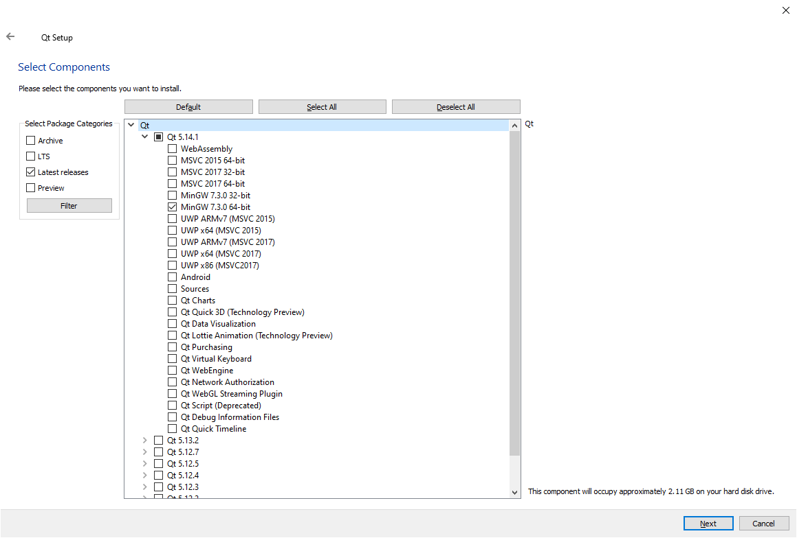
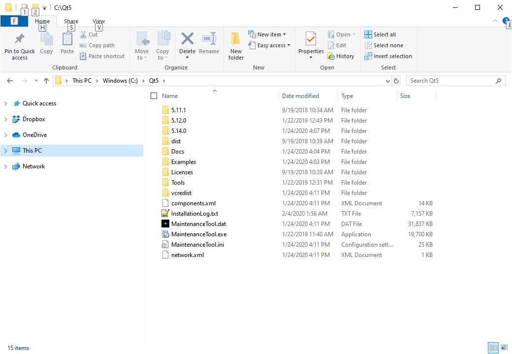

## How to install Qt and Qt Creator IDE
----

1.	Go to the webpage https://www.qt.io/download-qt-installer

2.	There will be a webpage about which operating system was found. Click the green download button.

3.	Run the installer and follow your desired options (**no need to create a Qt account**)

4.	Check the box "I have read and approve the obligations of using Open Source Qt"

5.	Select an installation folder. The default on Windows is `C:\Qt` You can change this directory if you want just make sure you remember where you installed Qt.

6.	There may be a screen about component selection with a title "Select Components". This is the screen where the worst mistakes for installing Qt are made. There is a list of Qt versions and each version has several "kits" which are the compilers. 

> :warning: Do NOT check all of a Qt versions or the select all button or else you will end up with a 100+ gigabyte installation of pointless versions!

Click the arrow and expand the "Qt 5.14.1" version. If you are on Windows 10 check the `MinGW 7.3.0 64bit` version. If you are not on Windows choose a `gcc` compiler that is 64bit. Below is what screen you should see.

7.	Once the correct version of Qt is selected click the next button and accept the license agreement

8.	Once you install Qt the versions can be edited using the maintainence tool. This tool is found in the `C:\Qt` directory (on Windows) or whatever directory you installed Qt. Below is an example on Windows 10 of what the Qt directory looks like and where the maintenance tool is located.

### How to open a Qt project with the Qt Creator IDE
----

1. Go to the start menu or search bar and type in "Qt Creator" This may be different if you are using Mac OS or Linux

2. Select the .pro file. All GUI applications are loaded using the .pro file. The pro file contains a list of all of C++ source, C++ header, GUI .ui, and resource files.

3. When loading a .pro file for the first time you must select a kit. Select a kil and click "Configure Project" This step is only required when you open a Qt project file for the first time.

4. Click the green triangle to build and run the program.
